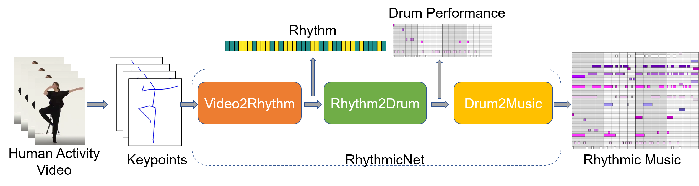
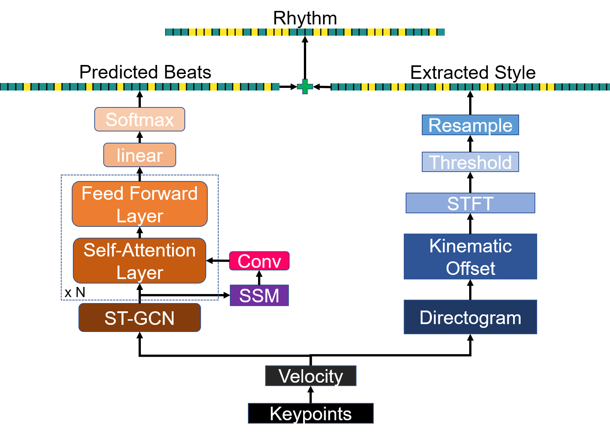
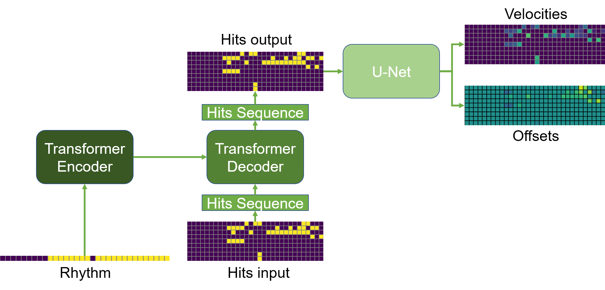
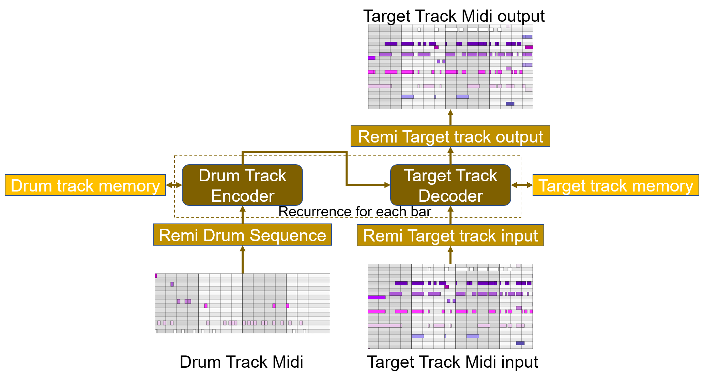

# How Does it Sound? Generation of Rhythmic Soundtracks for Human Movement Videos
Kun Su*, Xiulong Liu*, [Eli Shlizerman](http://faculty.washington.edu/shlizee/)
University of Washington

## Introduction
This repo holds the code and project page for the work **How Does it Sound? Generation of Rhythmic Soundtracks for Human Movement Videos** ([paper](https://openreview.net/pdf?id=JuNatTaGZ6J)) presented in NeurIPS 2021.

## Abstract
One of the primary purposes of video is to capture people and their unique activities. It is often the case that the experience of watching the video can be enhanced by adding a musical soundtrack that is in-sync with the rhythmic features of these activities. How would this soundtrack sound? Such a problem is challenging since little is known about capturing the rhythmic nature of free body movements. In this work, we explore this problem and propose a novel system, called ***‘RhythmicNet’***, which takes as an input a video with human movements and generates a soundtrack for it. RhythmicNet works directly with human movements, by extracting skeleton keypoints and implementing a sequence of models translating them to rhythmic sounds. RhythmicNet follows the natural process of music improvisation which includes the prescription of streams of the beat, the rhythm and the melody. In particular, RhythmicNet first infers the music beat and the style pattern from body keypoints per each frame to produce the rhythm. Next, it implements a transformerbased model to generate the hits of drum instruments and implements a U-net based model to generate the velocity and the offsets of the instruments. Additional types of instruments are added to the soundtrack by
further conditioning on generated drum sounds. We evaluate RhythmicNet on large scale video datasets that include body movements with inherit sound association, such as dance, as well as ’in the wild’ internet videos of various movements and actions. We show that the method can generate plausible music that aligns with different types of human movements.

## Motivation
In the ‘How does it Sound’ project we address the challenge of *whether an AI system can generate rhythmic music corresponding to videos with human movements*.
We built a full pipeline named as 'RhythmicNet'. It takes **frames of body keypoints** as input and **generates rhythmic music for that video**. Note that our system can generalize on 'in-the-wild' videos, Here is an example of generated samples for volleyball video:

## Generated Samples

## Components of RhythmicNet
RhythmicNet contains three major components:
- Video2Rhythm : Beat prediction + Style Extraction to compose Music Rhythm
- Rhythm2Drum: Drum Music Generation Based on Music Rhythm
- Drum2Music: Full Music (with Piano or Guitar) generation based on Drum Track

The components are shown in the figure above. We describe each component separately below.

    
    System overview of RhythmicNet.

### Beat prediction + Style Extraction (Video2Rhythm)

    

We decompose the rhythm into two streams: beats and style. We propose a novel model to predict music beats and a kinematic offsets based approach to extract style patterns from human movements. Beat is a binary periodic signal determined by fixed tempo, and it is obtained by music beat prediction network, which learns the beat by pairing body keypoints with ground truth music beats in a supervised way. We propose a novel graph-based attention model that can well capture the regular pattern of beats from human body movements. In addition to beats, irregular patterns also exist in the rhythm, which is also called style. To extract style, we represent the changing motions as kinematic offsets, and apply spectral analysis technique on top of it to extract frames with fast-changing motions, which is the style pattern. By combining beats and style, we get the rhythm.

### Drum Music Generation Based on Music Rhythm (Rhythm2Drum)

    

 

Rhythm2Drum interprets the provided rhythm from previous stage into drum sounds. Each drum track can be represented by three matrices: hits, velocities, and offsets. The hits represent the presence of drum onsets, velocity represents the loudness of hits, and offsets represent the time shift of each hit. Rhythm2Drum contains 2 stages. In the first stage, it implements an Encoder-Decoder Transformer that given the rhythm generates the drums performance Hits (onsets). The Transformer generates natural and diverse drum onsets by autoregressively learning the hits as a word sequence conditioned on the rhythm. In the second stage, a U-net type model generates the drum Velocities and Offsets. The U-Net learns them conditioned on the Hits matrix.

### Full Music (with Piano or Guitar) generation based on Drum Track (Drum2Music)

    

In this last stage we add further instruments to enrich the soundtrack. Since the drum track contains rhythmic music, we propose to condition the additional instrument stream on the generated drum track. We consider the piano or guitar as the additional instruments, since these are dominant instruments. Drum2Music completes the drum music by adopting an Encoder-Decoder architecture using transformer-XL to generate a music track of either piano or guitar conditioning on the generated drum performance.

## Contact
For more information, contact [NeuroAI](http://faculty.washington.edu/shlizee/) lab at University of Washington
Eli Shlizerman (PI) [shlizee@uw.edu](mailto:shlizee@uw.edu)
